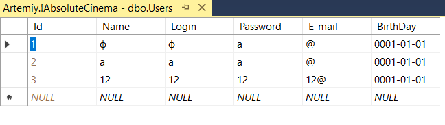
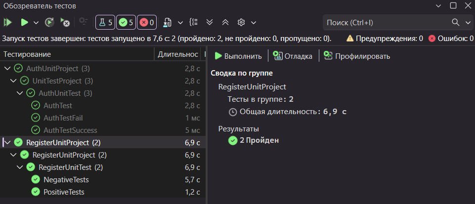

# Практическая работа №6 — Юнит-тестирование программных модулей

**Дисциплина:** Поддержка и тестирование программных модулей  
**Группа:** 3ИСИП-423  
**Студенты:** Резанцев Артемий, Трудова Анастасия 
**Преподаватель:** Аксёнова Татьяна Генадьевна

---

## Содержимое таблицы пользователей (Microsoft SQL Server)

---

## Окно «Обозреватель тестов»

---

## Вывод о проведённом тестировании

В ходе работы было реализовано и запущено **5 тестов** в двух проектах юнит-тестирования:

### AuthUnitProject — 3 теста (все пройдены)

| Тест | Результат |
|------|-----------|
| AuthTest | Пройден |
| AuthTestFail | Пройден |
| AuthTestSuccess | Пройден |

Тесты проверяют логику аутентификации: базовый сценарий входа, а также намеренно негативный и позитивный случаи. Все три теста прошли успешно, так как реализация методов аутентификации корректно обрабатывает переданные входные данные и возвращает ожидаемые результаты.

### RegisterUnitProject — 2 теста (все пройдены)

| Тест | Результат |
|------|-----------|
| NegativeTests | Пройден |
| PositiveTests | Пройден |

Тесты проверяют логику регистрации пользователей: `PositiveTests` проверяет успешную регистрацию с корректными данными, `NegativeTests` — поведение системы при вводе невалидных данных (например, пустые поля или дублирующийся логин). Оба теста пройдены, что подтверждает корректную валидацию и обработку данных в модуле регистрации.

**Итог:** все **5 из 5** тестов выполнены успешно. Программные модули аутентификации и регистрации работают в соответствии с ожидаемым поведением.

